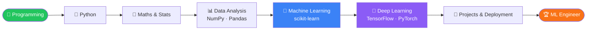

<div align="center">


<a href="https://git.io/typing-svg">
  
</a>

<br/>


</div>

---

## 👨‍💻 About Me

```python
class Swarnajit:
    name = "Swarnajit Chatterjee"
    location = "Kolkata, India 🇮🇳"
    goal = "Become a Machine Learning Engineer 🤖"
    learning = ["Python", "Machine Learning", "Deep Learning", "Data Science", "JavaScript"]
    building = "Web apps today, intelligent systems tomorrow"
    fun_fact = "I train models and my patience at the same time 😄"
    open_to = ["Internships", "Collaborations", "ML projects"]
```

---

## 🛠️ Tech Stack

<div align="center">

**Languages & Web**


**AI / ML / Data**


**Tools**


</div>

---

## 🗺️ My ML Engineer Roadmap



---

## 🔥 Featured Projects

| Project | Description |
|---------|-------------|
| 📚 [**javascript**](https://github.com/sn009-cloud/javascript) | 16 JavaScript topics from basics to Async/Await, plus 4 projects |
| 🎮 **Tic Tac Toe** | Two-player browser game |
| ✊ **Stone Paper Scissors** | Play against the computer |
| 🍔 **Zomato Frontend** | Food delivery UI clone |

---

## 📊 GitHub Stats

<div align="center">


<br/>


</div>

---

## 📈 Learning Progress

<div align="center">


</div>

---

## 🎯 Milestones

- ✅ Completed 16 JavaScript topics, from basics to Async/Await
- ✅ Built 4 projects: Tic Tac Toe, Stone Paper Scissors, Astrology App, Zomato Frontend
- 🔄 Learning Python and Machine Learning fundamentals
- ⏳ Next: Deep Learning with TensorFlow and PyTorch
- ⏳ Goal: Build and deploy my first end-to-end ML project

---

## 🧠 Neural Network

<div align="center">


</div>

---

## 📫 Let's Connect

<div align="center">

[](https://www.linkedin.com/in/swarnajit-chatterjee-645639376/)
[](mailto:swarnajitchatterjee690@gmail.com)

<br/>


</div>
